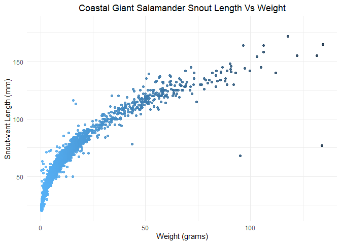

```r
# read in data
mack_verts <- read_csv(here::here("data", "AS00601.csv"))
```

```
## Rows: 32209 Columns: 18
```

```
## -- Column specification --------------------------------------------------------
## Delimiter: ","
## chr  (8): DBCODE, SITECODE, SECTION, REACH, UNITTYPE, SPECIES, CLIP, NOTES
## dbl  (9): ENTITY, YEAR, PASS, UNITNUM, VERT_INDEX, PITNUMBER, LENGTH1, LENGT...
## date (1): SAMPLEDATE
```

```
## 
## i Use `spec()` to retrieve the full column specification for this data.
## i Specify the column types or set `show_col_types = FALSE` to quiet this message.
```

```r
skim(mack_verts)
```


Table: Data summary

|                         |           |
|:------------------------|:----------|
|Name                     |mack_verts |
|Number of rows           |32209      |
|Number of columns        |18         |
|_______________________  |           |
|Column type frequency:   |           |
|character                |8          |
|Date                     |1          |
|numeric                  |9          |
|________________________ |           |
|Group variables          |None       |


**Variable type: character**

|skim_variable | n_missing| complete_rate| min| max| empty| n_unique| whitespace|
|:-------------|---------:|-------------:|---:|---:|-----:|--------:|----------:|
|DBCODE        |         0|          1.00|   5|   5|     0|        1|          0|
|SITECODE      |         0|          1.00|   8|   8|     0|        6|          0|
|SECTION       |         0|          1.00|   2|   2|     0|        2|          0|
|REACH         |         0|          1.00|   1|   1|     0|        3|          0|
|UNITTYPE      |       610|          0.98|   1|   2|     0|        7|          0|
|SPECIES       |         3|          1.00|   4|   4|     0|        3|          0|
|CLIP          |         0|          1.00|   2|   4|     0|        4|          0|
|NOTES         |     29035|          0.10|   1|  70|     0|      249|          0|


**Variable type: Date**

|skim_variable | n_missing| complete_rate|min        |max        |median     | n_unique|
|:-------------|---------:|-------------:|:----------|:----------|:----------|--------:|
|SAMPLEDATE    |         0|             1|1987-10-06 |2019-09-05 |2006-09-06 |       99|


**Variable type: numeric**

|skim_variable | n_missing| complete_rate|        mean|         sd|       p0|         p25|         p50|         p75|        p100|hist                                     |
|:-------------|---------:|-------------:|-----------:|----------:|--------:|-----------:|-----------:|-----------:|-----------:|:----------------------------------------|
|ENTITY        |         0|          1.00|        1.00|       0.00|     1.00|        1.00|        1.00|        1.00|        1.00|▁▁▇▁▁ |
|YEAR          |         0|          1.00|     2004.92|       8.57|  1987.00|     1998.00|     2006.00|     2012.00|     2019.00|▃▆▇▇▇ |
|PASS          |         0|          1.00|        1.22|       0.42|     1.00|        1.00|        1.00|        1.00|        2.00|▇▁▁▁▂ |
|UNITNUM       |         0|          1.00|        7.70|       4.94|     1.00|        3.00|        7.00|       11.00|       20.00|▇▅▆▃▁ |
|VERT_INDEX    |         0|          1.00|       20.17|      21.17|     1.00|        5.00|       13.00|       27.00|      147.00|▇▂▁▁▁ |
|PITNUMBER     |     26574|          0.17| 16286432.17| 7451568.76| 62048.00| 13713631.50| 18570447.00| 19132429.00| 28180046.00|▃▁▅▇▃ |
|LENGTH1       |        17|          1.00|       73.83|      33.42|    19.00|       47.00|       63.00|       97.00|      253.00|▇▅▂▁▁ |
|LENGTH2       |     19649|          0.39|      100.49|      34.74|    28.00|       77.00|       98.00|      119.00|      284.00|▃▇▂▁▁ |
|WEIGHT        |     13268|          0.59|        8.90|      10.68|     0.09|        1.51|        6.05|       11.66|      134.59|▇▁▁▁▁ |

```r
# clean stuff up
mack_verts <- janitor::clean_names(mack_verts)

mc_wt_5 <- mack_verts$WEIGHT[5]
```

```
## Warning: Unknown or uninitialised column: `WEIGHT`.
```

```r
mc_length_8_20 <- mack_verts$LENGTH1[8:20]
```

```
## Warning: Unknown or uninitialised column: `LENGTH1`.
```

```r
mc_length_8_20
```

```
## NULL
```

```r
mc_dates <- mack_verts$SAMPLEDATE
```

```
## Warning: Unknown or uninitialised column: `SAMPLEDATE`.
```


```r
# Salamander data ! 

mc_salamanders <- mack_verts %>% janitor::clean_names() %>% filter(species=='DITE')
mc_salamanders
```

```
## # A tibble: 11,758 x 18
##    dbcode entity  year sitecode section reach  pass unitnum unittype vert_index
##    <chr>   <dbl> <dbl> <chr>    <chr>   <chr> <dbl>   <dbl> <chr>         <dbl>
##  1 AS006       1  1993 MACKCC-L CC      L         1       1 P                16
##  2 AS006       1  1993 MACKCC-L CC      L         1       2 C                36
##  3 AS006       1  1993 MACKCC-L CC      L         1       2 C                37
##  4 AS006       1  1993 MACKCC-L CC      L         1       2 C                38
##  5 AS006       1  1993 MACKCC-L CC      L         1       2 C                39
##  6 AS006       1  1993 MACKCC-L CC      L         1       2 C                40
##  7 AS006       1  1993 MACKCC-L CC      L         1       2 C                41
##  8 AS006       1  1993 MACKCC-L CC      L         1       2 C                42
##  9 AS006       1  1993 MACKCC-L CC      L         1       2 C                43
## 10 AS006       1  1993 MACKCC-L CC      L         1       2 C                44
## # ... with 11,748 more rows, and 8 more variables: pitnumber <dbl>,
## #   species <chr>, length1 <dbl>, length2 <dbl>, weight <dbl>, clip <chr>,
## #   sampledate <date>, notes <chr>
```

```r
# Plots salamander! 

plot_snout_weight <- ggplot(data = mc_salamanders, aes(x = weight, y = length1)) +
  geom_point(aes(color = -weight),alpha=0.85,size=1.5, show.legend = FALSE) +
  theme_minimal()+
  theme(plot.title = element_text(hjust = 0.5))+
  labs(title = "Coastal Giant Salamander Snout Length Vs Weight",
       x = "Weight (grams)",
       y = "Snout-vent Length (mm)")

plot_snout_weight
```

```
## Warning: Removed 5429 rows containing missing values (geom_point).
```

<!-- -->

```r
ggsave(here::here("figs", "salamander_size.png"), height = 6, width = 7)
```

```
## Warning: Removed 5429 rows containing missing values (geom_point).
```


```r
# olympic salamanders

mc_oly_sal <- mack_verts %>% filter(species=='RHOL')

ggplot(data = mc_oly_sal, aes(x = weight, y = length1)) +
  geom_point(aes(color = species), show.legend = TRUE) +
  theme(plot.title = element_text(hjust = 0.5))+
  labs(title = "Olympic Salamander Total Length Vs Weight",
       x = "Weight (grams)",
       y = "Snout-fork/Total Length (mm)")
```

```
## Warning: Removed 6 rows containing missing values (geom_point).
```

<!-- -->

```r
# all species


mc_all <- ggplot(data = mack_verts, aes(x = weight, y = length1)) +
  geom_point(aes(color=reach, shape=species), show.legend = TRUE) +
  theme(plot.title = element_text(hjust = 0.5))+
  labs(title = "All Species Total Length Vs Weight",
       x = "Weight (grams)",
       y = "Snout-fork/Total Length (mm)")


mc_all
```

```
## Warning: Removed 13279 rows containing missing values (geom_point).
```

<!-- -->


